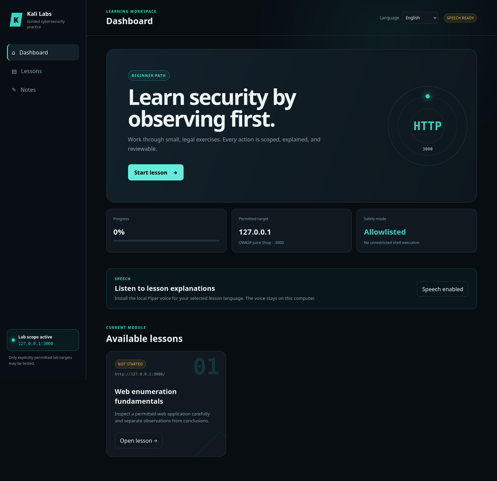
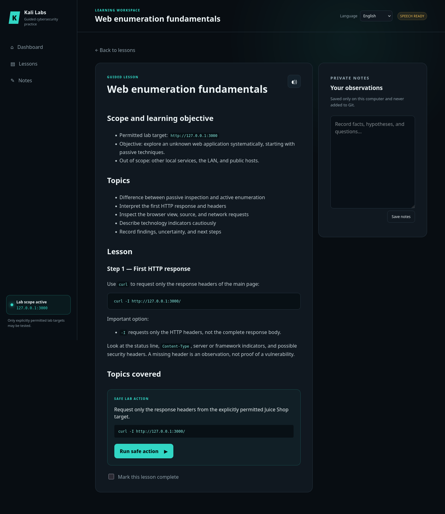

# Kali Cybersecurity Labs

An interactive English/Dutch learning environment for legal cybersecurity training on Kali Linux. The repository contains reusable tutorials, helper scripts, and explicit scope rules. Personal notes and tool output remain local.

Nederlandse documentatie: [README.nl.md](README.nl.md)

## Screenshots

### Dashboard and beta speech support



### Guided web-enumeration lesson



## Safety and scope

Use security tools only on systems for which you have explicit permission. The example target in the included lessons is OWASP Juice Shop at `http://127.0.0.1:3000`. Other local services, LAN devices, and public hosts are not automatically in scope.

Read [AGENTS.md](AGENTS.md) before use; it defines the teaching approach and safety rules for an AI coding assistant.

## Installation

Requirements:

- Kali Linux or a similar Debian-based Linux distribution
- Python 3 with virtual-environment support
- internet access when installing optional speech support
- PipeWire (`pw-play`) for audio output

Clone the repository and run setup:

```bash
git clone https://github.com/MrHymanz/kali-cybersecurity-labs.git
cd kali-cybersecurity-labs
./scripts/setup.sh
```

The English-language setup asks for two independent preferences:

1. Lessons in English or Dutch
2. English speech, Dutch speech, or no speech

When speech is enabled, Piper is installed in `.venv/` and the selected voice in `voices/`. These stay local and are not stored in Git. Setup does not use `sudo` or modify the global Python installation.

Test optional speech with:

```bash
./scripts/speak.sh --text "De leeromgeving is klaar voor gebruik."
```

## Graphical interface

Start the local interface after setup:

```bash
./scripts/start-gui.sh
```

The start script checks Docker, starts the existing `juice-shop` container when
needed, and waits for the permitted lab target at `http://127.0.0.1:3000` to
become reachable. The container must already have been created. Stopping the GUI
does not stop the container.

Open `http://127.0.0.1:8080` in a browser. The interface provides:

- an English/Dutch lesson dashboard;
- local progress and private notes;
- optional text-to-speech;
- clearly explained, allowlisted lab actions;
- terminal output with interpretation prompts.

### Enabling speech

Select **Enable speech** on the dashboard. The site installs Piper in the local
`.venv/` and downloads only the fixed voice for the selected lesson language.
Those files and `.tts.conf` remain local and are excluded from Git. Internet
access and PipeWire (`pw-play`) are required. You can then use the read-aloud
button inside a lesson.

The server listens only on `127.0.0.1`. It does not offer an unrestricted command field: each runnable action is defined server-side and tied to a specific lesson and permitted target. Press `Ctrl+C` in the starting terminal to stop it.

## Project structure

- `tutorials/en/` and `tutorials/nl/` — shared lessons in both languages
- `app/` — dependency-free local web interface and server
- `scripts/` — setup and helper scripts
- `notes/` — local learning notes; only templates are tracked
- `output/` — local, relevant tool output; contents are not tracked
- `AGENTS.md` — teaching, scope, and safety instructions

## Privacy before a commit

Always inspect what you are about to publish:

```bash
git status --short
git diff --cached
```

Do not commit credentials, tokens, personal data, real target details, or unfiltered security-tool output.

## Speech software and voices

Optional speech uses [Piper](https://github.com/OHF-Voice/piper1-gpl). Piper downloads voice models from the [Piper voices collection](https://huggingface.co/rhasspy/piper-voices). Check a voice's model card for its dataset license before redistributing it.

## License

The original content in this project is available under the [MIT License](LICENSE). External software, voice models, and datasets retain their own licenses.
