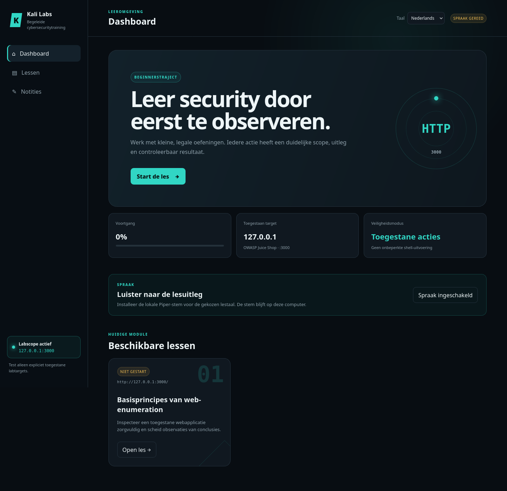
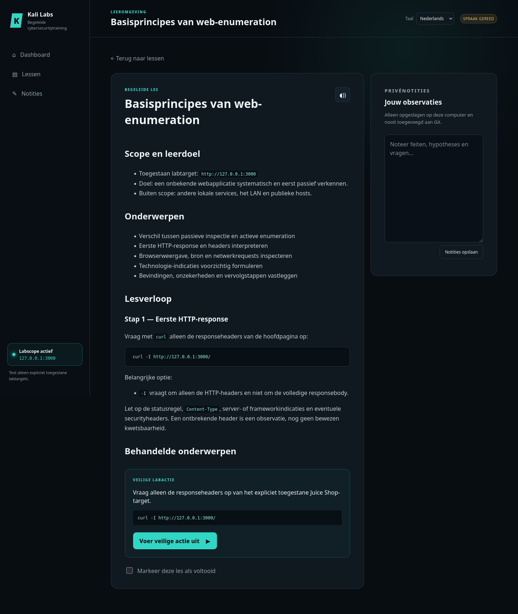

# Kali Cybersecurity Labs

Een interactieve Engels/Nederlandse leeromgeving voor legale cybersecuritytraining op Kali Linux. De installatie is Engelstalig en laat iedere gebruiker afzonderlijk de lestaal en eventuele spreektaal kiezen.

## Schermafbeeldingen

### Dashboard en bèta-spraakfunctie



### Begeleide les web-enumeration



## Installatie

```bash
git clone https://github.com/MrHymanz/kali-cybersecurity-labs.git
cd kali-cybersecurity-labs
./scripts/setup.sh
```

De installatie vraagt eerst om Engels of Nederlands als lestaal. Daarna kies je Engelse spraak, Nederlandse spraak of geen spraak. De keuzes en gedownloade stemmodellen blijven lokaal.

## Grafische interface

Start na de installatie de lokale GUI:

```bash
./scripts/start-gui.sh
```

Het startscript controleert Docker, start de bestaande container `juice-shop` als die
stilstaat en wacht totdat het toegestane labtarget op `http://127.0.0.1:3000`
bereikbaar is. De container moet vooraf zijn aangemaakt. Het script stopt de
container niet wanneer je de GUI afsluit.

Open daarna `http://127.0.0.1:8080`. Het dashboard bevat lessen, voortgang, privénotities, optionele spraak en veilige labacties. De server luistert alleen op `127.0.0.1` en biedt geen veld voor willekeurige shellcommando's. Stop de server met `Ctrl+C` in de terminal waarin je hem hebt gestart.

### Optionele AI-begeleiding

Open **Instellingen** om een AI-backend te kiezen. De interface ondersteunt een
lokale Ollama-server, een OpenAI-compatibele server en OpenAI. Per beoordeling
kun je bepalen of lesmateriaal, commando-uitvoer en je notities worden meegestuurd.
Ollama is beperkt tot een lokaal loopbackadres. Bij externe providers toont de
interface een privacywaarschuwing.

API-sleutels worden alleen door de lokale Python-server gebruikt. Ze worden nooit
naar de browser teruggestuurd en blijven in het door Git genegeerde `.local/` met
bestandsrechten `0600`. Je kunt voor OpenAI ook de omgevingsvariabele
`OPENAI_API_KEY` gebruiken; die heeft voorrang op een lokaal opgeslagen sleutel.

Een API-koppeling is niet verplicht. Gebruik in een geopende les **Kopieer voor
ChatGPT/Codex** om de lesnaam, scope, het commando, de uitvoer en je notities als
één begeleide bespreektekst naar het klembord te kopiëren. Plak die tekst daarna
in een bestaand ChatGPT- of Codex-gesprek. Deze handmatige route gebruikt je
normale abonnement, vereist geen API-sleutel en verstuurt vanuit de labinterface
zelf niets naar een externe dienst.

### Spraak inschakelen

Klik op het dashboard op **Spraak inschakelen**. De site installeert Piper in de
lokale `.venv/` en downloadt alleen de vaste stem voor de gekozen lestaal. Deze
bestanden en `.tts.conf` blijven lokaal en worden niet aan Git toegevoegd. Voor
de installatie zijn internettoegang en PipeWire (`pw-play`) nodig. Daarna kun je
in een geopende les de voorleesknop gebruiken.

Zie de uitgebreide [Engelse README](README.md) voor vereisten, privacycontroles, projectstructuur en licentie-informatie.
